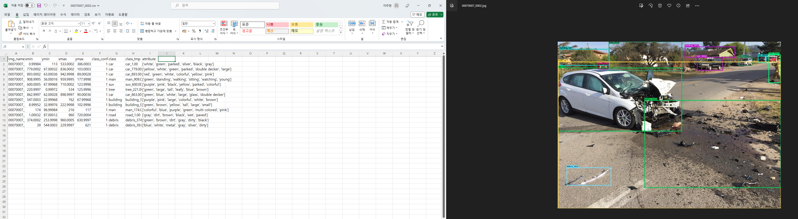
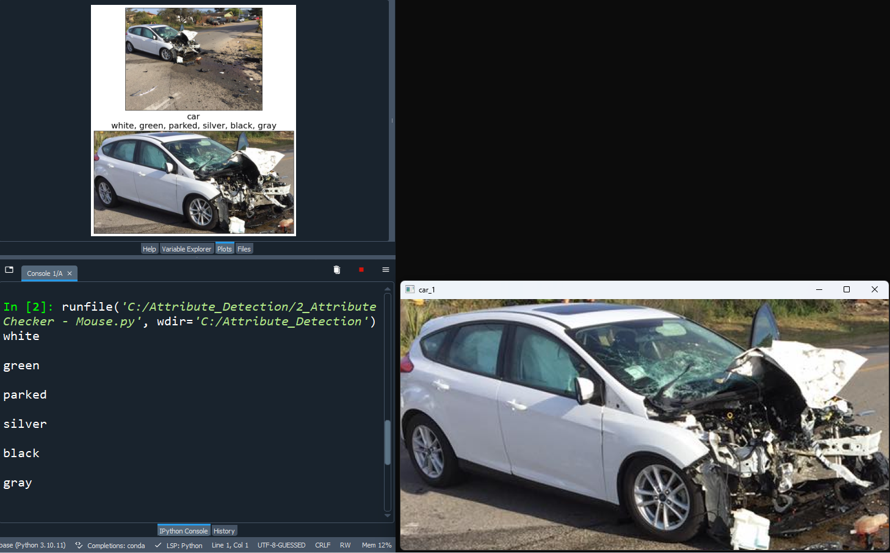

# Attribute Labeling
This is a code which helps faster labeling image.
Purpose of these code is to modify attributes which initially generated by AI. Initial attributes are incorrect.

Two process of data labeling in attribute.
1. remove [] and '' in 'attribute' column as list format. ex) ['gray', 'red', 'white', 'metal', 'silver', 'black'] => gray, red, white, metal, silver, black
2. make new column as 'attribute_refine' and copy proper attribute from 'attribute' column.

# Steps of preprocessing
For efficient labeling, I added additional steps for exceptional case on labeling. Step 3 ~ 11 is optional.
After Step 2, run 2_Attribute Checker - Mouse.py and check attribute by mouse (process 2).

1. Replace drive, folder addresses for each .py file (current version : 07)
2. Run 1_Attribute Detector shell fix.py to obtain processed csv files (process 1)
3. Find and remove the csv file of the duplicate image in the 0_Image_Detected folder through the program in the 2_attribute folder
4. After modifying the folder in Comparer - Class.py, run #1 to note the newly added class separately
5. Run #2 of Comparer - Class.py to overwrite the newly changed class_list
6. After modifying the folder in Comparer - Attribute.py, run #1 to make a separate note of the newly added attributes
7. Run #2 of Comparer - Attribute.py to overwrite the newly changed attribute_list
8. Modify the folder in Specific Attribute Remove.py and apply it to 2_Attribute Checker - Mouse.py for the new class from the results you run
9. Check class_list.txt to see if there are any attributes that will go in unconditionally
10. Check class_list.txt for new additions to metallic, unimaterial, and unicolor
11. Look at attribute_list.txt to see if there is anything new to apply to an existing class

# Labeling Steps
After preprocessing, run 2_Attribute Checker - Mouse.py to labeling.
2_Attribute Checker - Mouse.py loads csv file and its corresponding image.

1. run 2_Attribute Checker - Mouse.py
2. click left button of mouse to remain attribute and click right button of mouse to remove attribute.

After all objects in the image are processed, the modified csv file will be saved.

# Trick for efficient labeling
In 2_Attribute Checker - Mouse.py, there is a code for exceptional attribute.

1. att_dict consist of key-value from classes and attributes. Classes are in key and attributes are in values. 

    (for example, value 'sleeping' is in key 'bag'.) 

2. unimaterial means consist of one material. If one attribute belongs to materials, other materials attribute can not remain.
 
3. unicolor means consist of one color. If one attribute belongs to colors, other colors attribute can not remain.
 
4. There is automatical remain code for some classes. 

    (for example, attribute 'wet' should be remained in class 'water') 
   
5. There is automatical remove code for some conflict attributes.
    (for example, if attribute 'bald' remains some class, attribute 'hairy' should be removed.) 

# Screenshots of disaster image labeling

Before preprocessing

- Hard to find matched object.
- Hard to write down correct object.

After preprocessing

- Only shows an object which matched to attribute list.
- Automatically save the chosen attribute to .csv files.

# Additional  Task - reclassifying disaster image from Incidents1M
There is an additional task to make a large dataset about disaster image.

In Incidents1M, There arr too many unrelated images to the disaster.
My Additional task is reclassifying real disaster images from Incidents1M.

Incidents1M is too large to classified by human eyes.
So, I used CLIP model to pre-reclassifying Incidents1M.

There are two steps to classify by using CLIP
1. give a prompt to CLIP, such as "A photo of a disaster or an accident." and "A photo of no disaster or no accident.". Then, CLIP automatically classifying disaster image.
2. Check only disaster image folders using your eyes.

I tested another real disaster image datasets.
The result that the true positive (classify a real disaster image to a disaster.) was high and the false negative (classify a real disaster image to not a disaster.) was low. Hence, high recall was gained by CLIP.

Unfortunately, the true negative (classify non-disaster image to a disaster) was not high and the false positive(classify non-disaster image to not a disaster) was not low.

Because of high recall value, I used CLIP to pre-classifying Incidents1M.
For example, There are 75,000 image samples from Incidents1M. CLIP classified 46,376 images as a disaster and 28,624 images as not a disaster.

Hence, I have to only 46,376 images to classify disaster images.

To pre-reclassifying Incidents1M, I used only 'disaster_detector.py'.
